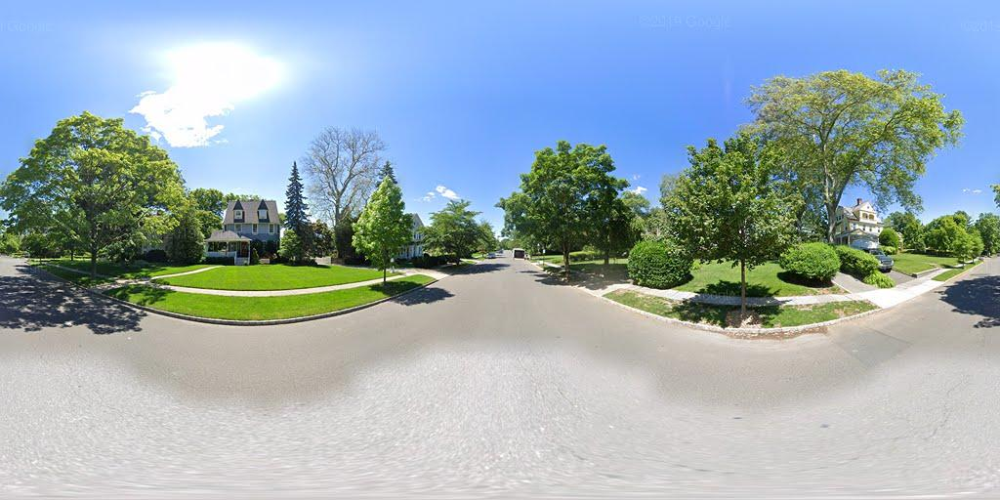
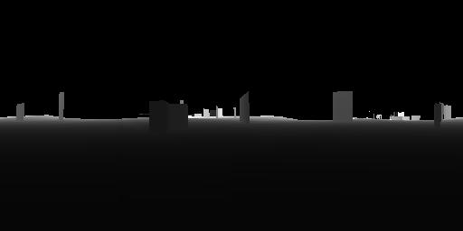

# Google Street View

## Prerequisites
Have numpy, scipy, requests, and PIL (or Pillow) installed.
Alternatively, run 
```bash
pip install -r requirements.txt
```

## Examples
```python
import numpy as np
from PIL import Image
from pano import Pano
pano = Pano(pano_id="lepFQSQxEEGAw4PPqR_9Ag", zoom=2)
pano.panorama.show()
```
 
```python
dm_pixels = np.reshape(pano.depth_map.depth_map, (-1, 512))
img = Image.fromarray(np.uint8(dm_pixels * 255/100), 'L')
img.show()
```
 
